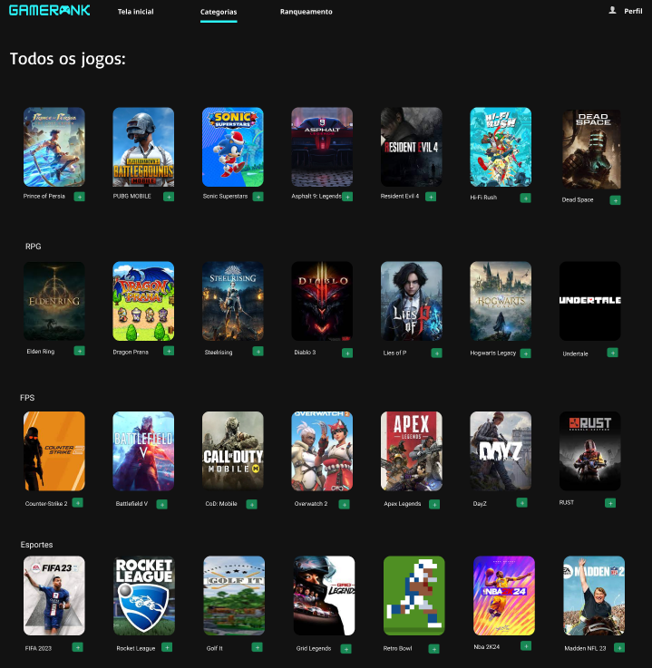
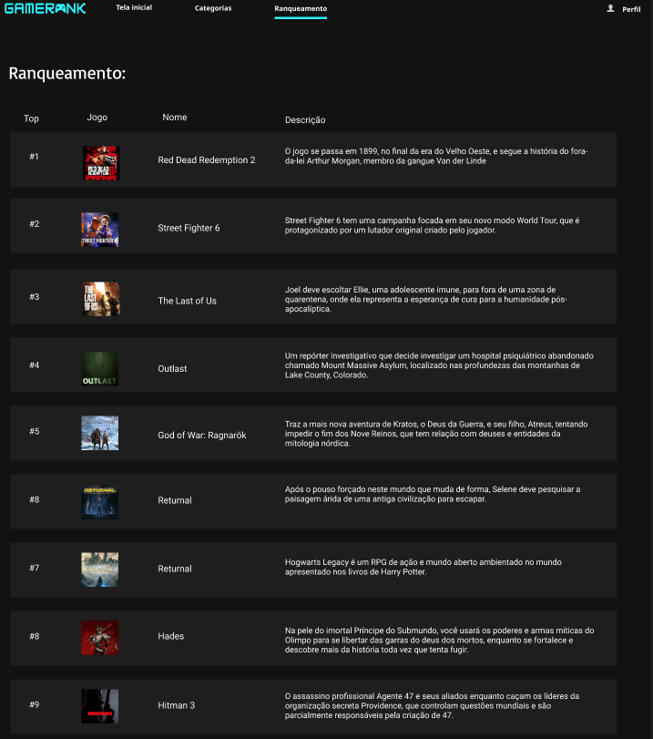

# GameRank


 Bem-vindo à GameRank, uma plataforma interativa que oferece aos entusiastas de jogos a oportunidade de explorar, avaliar e ranquear uma variedade de jogos. Nosso projeto visa criar uma experiência envolvente para os usuários, permitindo-lhes descobrir novos jogos e construir uma lista personalizada de favoritos.

## Índice
 - <a href= "#Funcionalidades">Funcionalidades</a>
 - <a href= "#layout">Layout</a>
 - <a href= "#rodar">Como rodar esse projeto?</a>
 - <a href= "#bd">Banco de Dados</a>
 - <a href= "#tecnologias?">Tecnologias Utilizadas?</a>
 - <a href= "#autores">Autores</a>


## Funcionalidades

- `Cadastro e login do Usuário:` Crie sua conta em apenas alguns passos simples e faça login de forma descomplicada, proporcionando a você uma entrada suave e rápida na nossa plataforma.

- `Navegue por Categorias:` Explore jogos em diversas categorias desde ação, rpg, fps, esportes, estratégia, aventura e corrida.

- `Visualização de Rankeamento:` Veja uma lista de jogos ranqueados com base em diferentes critérios. Explore informações essenciais, como nome, descrição e ano de lançamento.

- `Perfil Personalizado:` Gerencie e adicione jogos à sua lista de desejos e reviews de cada jogo.

- `Detalhes do Jogo em Destauqe:` Explore avaliações, comentários e informações abrangentes de cada jogo.

 

## Layout
   

   

  


## Como rodar esse projeto?

1. Clone o repositório:

    ```bash
    git clone https://github.com/pabloreis5/Gamerank-Projeto.git
    ```

2. Entre no diretório do projeto:

    ```bash
    cd Gamerank-Projeto
    ```

3. Execute a aplicação:

    ```bash
    python run.py
    ``` 
 
    
4. Abra o navegador e acesse [http://localhost:5000](http://localhost:5000).  

## Estrutura do Banco de Dados
O banco de dados inclui tabelas para usuários, jogos, lista de desejos e avaliações.

## Tecnologias Utilizadas
1. [SCSS](https://sass-lang.com/)

2. [HTML](https://developer.mozilla.org/pt-BR/docs/Web/HTML)

3. [CSS](https://developer.mozilla.org/pt-BR/docs/Web/CSS)

4. [Python](https://www.python.org/)

5. [JavaScript](https://developer.mozilla.org/pt-BR/docs/Web/JavaScript)


   
# Autores

[](https://github.com/allanysoalmeida) 
[](https://github.com/beatriztl)
[](https://github.com/Th3Creator)
[](https://github.com/matsa0)
[](https://github.com/pabloreis5)
[](https://github.com/RafaelFMLeite)


